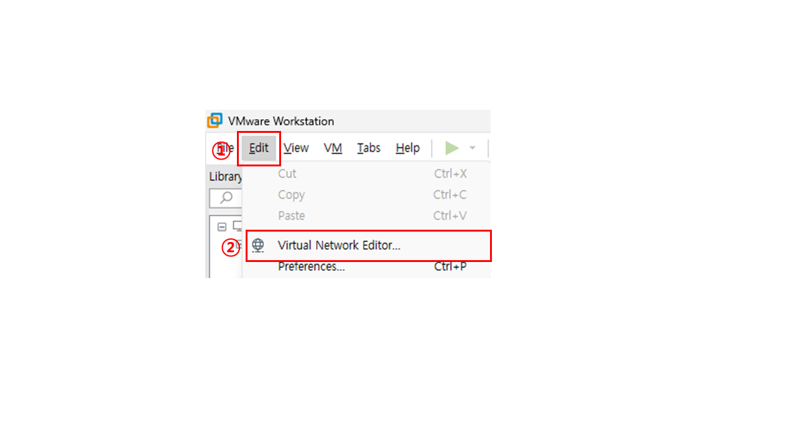

## SSL
>https://www.signgate.com/main.sg

### 사설 인증서

```bash
# rocky9-1


# 1. CA(인증기관)용 개인키 생성 (RSA 2048비트)
openssl genrsa -out ca.key 2048


# 2. CSR(인증서 서명 요청) 생성
openssl req -new -key ca.key -out ca.csr
Country Name (2 letter code) [XX]:KR
State or Province Name (full name) []:Seoul
Locality Name (eg, city) [Default City]:jongro-gu
Organization Name (eg, company) [Default Company Ltd]:sgm
Organizational Unit Name (eg, section) []:edu
Common Name (eg, your name or your server's hostname) []:sgm.local
Email Address []:sgm@sgm.local

Please enter the following 'extra' attributes
to be sent with your certificate request
A challenge password []: enter
An optional company name []: enter


# 3. 개인키로 직접 서명하여 인증서(crt) 발급 → self-signed
openssl x509 -req -days 365 -in ca.csr -signkey ca.key -out ca.crt


# 4. 인증서/개인키를 표준 경로에 배치
cp ca.crt /etc/pki/tls/certs/
cp ca.key /etc/pki/tls/private/

dnf install -y httpd
vi 
<html>
<body>
<h1>sgm-ssl-web</h1>

</body>
</html>

scp .\1.png root@10.0.0.11:/var/www/html/


dnf install -y mod_ssl

```

```bash
# rocky9-2


```

```bash
#win10
10.0.0.101/24
10.0.0.254
```